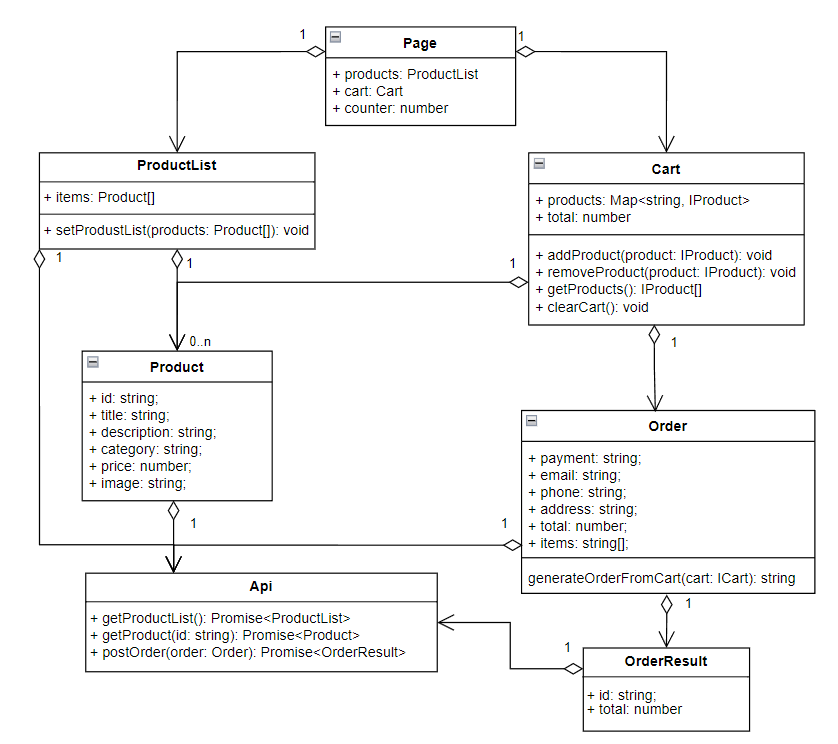

# Проектная работа "Веб-ларек"

Стек: HTML, SCSS, TS, Webpack

Структура проекта:
- src/ — исходные файлы проекта
- src/components/ — папка с JS компонентами
- src/components/base/ — папка с базовым кодом

Важные файлы:
- src/pages/index.html — HTML-файл главной страницы
- src/types/index.ts — файл с типами
- src/index.ts — точка входа приложения
- src/scss/styles.scss — корневой файл стилей
- src/utils/constants.ts — файл с константами
- src/utils/utils.ts — файл с утилитами

## Установка и запуск
Для установки и запуска проекта необходимо выполнить команды

```
npm install
npm run start
```

или

```
yarn
yarn start
```
## Сборка

```
npm run build
```

или

```
yarn build
```

## UML диаграмма



## Структура классов и интерфейсов:
- IPage: Контейнер для всей страницы, объединяющий список товаров и корзину.
- IProduct: Интерфейс описания товара с полями (id, название, описание, цена, категория, изображение).
- IProductList: Отвечает за управление списком товаров, позволяет обновлять каталог.
- ICart: Управляет корзиной, добавлением/удалением товаров, подсчётом итоговой суммы.
- IOrder: Хранит данные о заказе, включая способ оплаты, адрес и список товаров.
- IOrderResult: Отвечает за результат заказа, включая уникальный идентификатор.
- IApi: Реализует работу с сервером (загрузка товаров, отправка заказа).